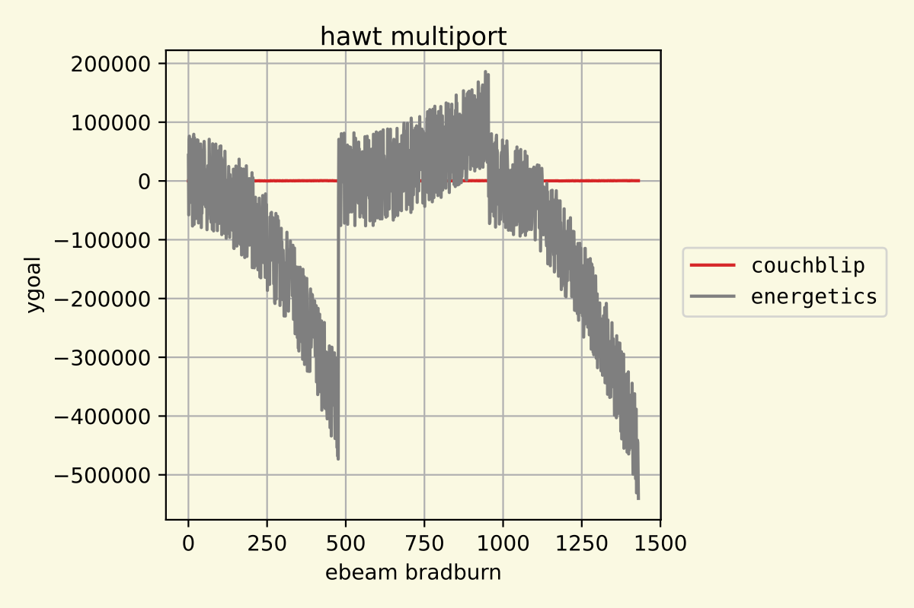
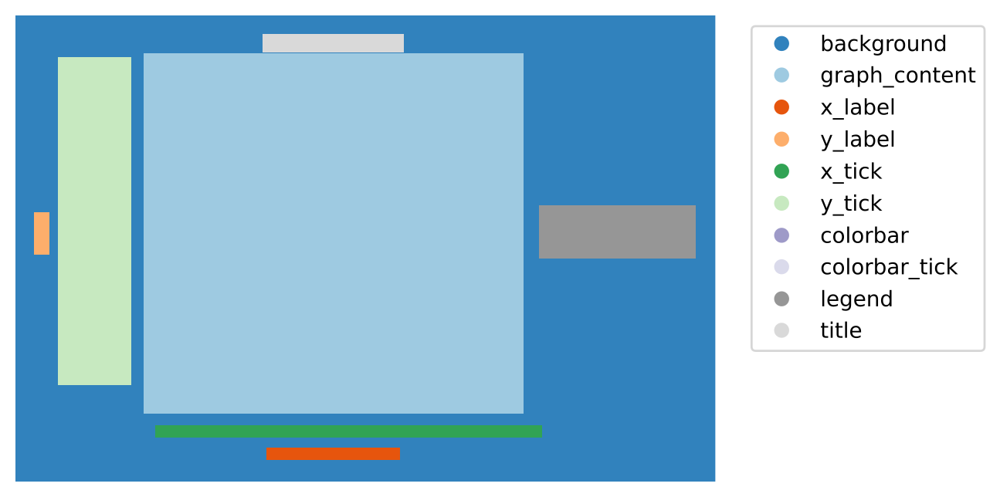

# Scientific Figure Component Dataset

Author: Ziyue "Alan" Xiang, Edward J. Delp

Direct all correspondence to Edward J. Delp, [ace@ecn.purdue.edu](mailto:ace@ecn.purdue.edu).


*(Example Figure)*



*(Corresponding Color-mapped Annotation)*



This dataset contains the following 9 types of scientific figures: bar, area, heatmap, line, horizontal bar, violin, box, stacked bar, and scatter plots. There are 150 images for each plot type. For each image file in `/graph`, there is a corresponding annotation file with the same filename in `/annotation`.


The annotation files are saved using the PNG format, with the pixel value corresponding to one of the element in the following list:

```python
[
    'background',
    'graph_content',
    'x_label',
    'y_label',
    'x_tick',
    'y_tick',
    'colorbar',
    'colorbar_tick',
    'legend',
    'title'
]
```


This dataset is used to train the [SciEye method](https://github.com/xziyue/SciEye) for the [Dataset Plot Matching Competition](https://sites.google.com/g.syr.edu/cri-comp-2022/dataset-plot-matching-challenge).


**WARNING: this dataset is constructed for training purposes only. The words in the figures are randomly chosen from a English dictionary, which may contain undesirable language. Please double check the contents if you wish to use graphs in this dataset for other purposes.**
